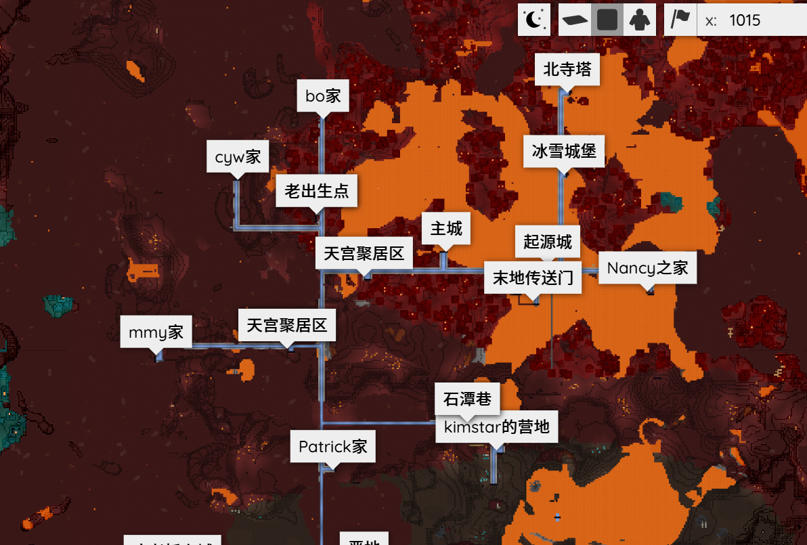

[←Back](..)

# Always Show Poi Labels

Make the labels of POI markers always visible on Bluemap.

Currently, the labels will only show up when you click on a POI marker, so maps containing a large number of POI markers may feel confusing.

| Original               | Always Show               |
| ---------------------- | ------------------------- |
|  |  |

Thanks to a community member [@yqs112358](https://github.com/yqs112358) for providing this cool feature!

## Installation Instructions

Download or copy the [BlueMapAlwaysShowPoiLabels.js](BlueMapAlwaysShowPoiLabels.js) file to your webapp, and register it.
([guide](https://bluemap.bluecolored.de/community/Customisation.html#custom-styles-theme-and-look))
