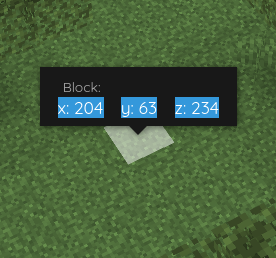

[←Back](..)

# Block Click Popup Select

This style makes the block popup selectable, so you can, for example, copy the coordinates.\
By default, it disappears when you try to click it.

## Installation Instructions

Download or copy the [BlueMapBlockClickPopupSelect.css](BlueMapBlockClickPopupSelect.css) file to your webapp, and register it.
([guide](https://bluemap.bluecolored.de/community/Customisation.html#theme-and-look))
