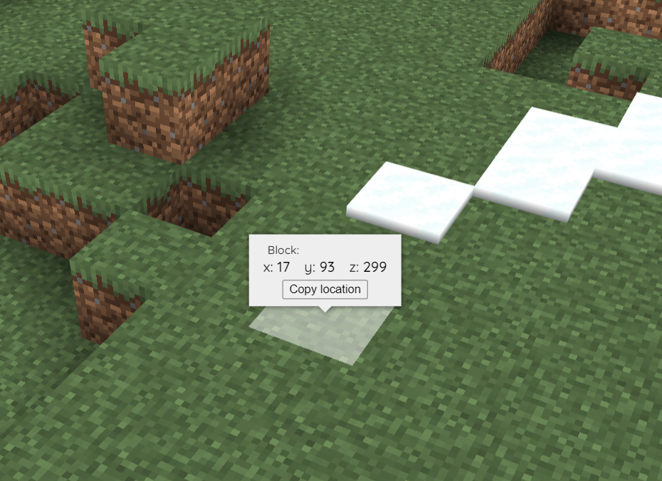

[←Back](..)

# Copy coordinates

If you want to copy the coordinates of a block you selected on the map, you can use this.  
It will add a customizable button to the coordinates popup
that will allow you to copy the selected coordinates to your clipboard.  
My initial need was to quickly add markers.
Since the web interface does not allow you to add markers directly,
this script makes the process much faster as you can just copy-paste coordinates into your map configuration.



❤️ Thanks to Antti ([@Chicken](https://github.com/Chicken)) over on the Bluemap Discord for the initial idea and code.

By [@tryallthethings](https://github.com/tryallthethings)

## Installation Instructions
To make this script work, you only need BlueMapCopyCoordinates.js.
The CSS file only centers the button as shown in the image.
Without it, it will be aligned to the left.
I recommend uploading both though, as this allows you to change the button further (colors, font, etc.)

Download or copy both the [BlueMapCopyCoordinates.js](BlueMapCopyCoordinates.js) script file
and the [BlueMapCopyCoordinates.css](BlueMapCopyCoordinates.css) style file to your webapp, and register them.

Here is a [guide for the registering js file](https://bluemap.bluecolored.de/community/Customisation.html#webapp-script-addons)
and a [guide for the registering css file](https://bluemap.bluecolored.de/community/Customisation.html#theme-and-look).


If you want to change the options, you can do so in the BlueMapCopyCoordinates.js.  
By default, it will copy the selected location in the Bluemap Marker format (called copy mode 3):

```json
"exmaplelabel-1": {
    "type": "poi",
    "position": {
        "x": 17,
        "y": 93,
        "z": 301
    },
    "label": "change-me-to-something-cool",
    "icon": "assets/poi.svg",
    "anchor": {
        "x": 25,
        "y": 45
    },
    "sorting": 0,
    "listed": true,
    "min-distance": 10,
    "max-distance": 10000000
}
```

## Configuration

### Option: `let poiLabel = "examplelabel";`
**Only relevant for copymode=3**  
Change this to what the marker id name should be called.

### Option: `let poiCounter = 0;`
**Only relevant for copymode=3**  
Set the starting number for the marker id name.
It will be incremented by 1 each time you click the copy button.\
Reloading the page will reset it to 0.\
It will output the names as _examplelabel-1_, _examplelabel-2_, _examplelabel-3_ and so forth.

### Option: `let buttonText = "Copy location";`
You can change the text of the button to anything you like. 

### Option: `let copyMode = 3;`
The last and most interesting option. Currently, there are 3 copy modes:

#### copymode = 1
Will copy only the "raw" coordinates (x y z):

```json
17 93 301
```

#### copymode = 2
Copies a teleportation command (/teleport x y z) that you can paste into minecraft.

```
/teleport 17 93 301
```

#### copymode = 3
Copies the complete marker data to create a bluemap marker.
```json
"exmaplelabel-1": {
    "type": "poi",
    "position": {
        "x": 17,
        "y": 93,
        "z": 301
    },
    "label": "change-me-to-something-cool",
    "icon": "assets/poi.svg",
    "anchor": {
        "x": 25,
        "y": 45
    },
    "sorting": 0,
    "listed": true,
    "min-distance": 10,
    "max-distance": 10000000
}
```
