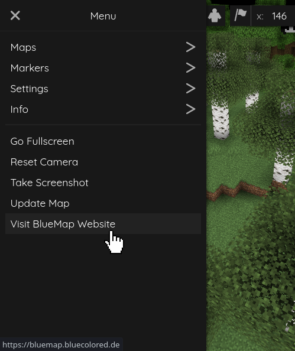

[←Back](..)

# Custom Sidebar Button
Thanks to community member [@Chicken](https://github.com/Chicken/)
for being the first to devise a workaround for BlueMap's immutable UI!



## Installation Instructions
Download or copy the [BlueMapCustomSidebarButton.js](BlueMapCustomSidebarButton.js) file to your webapp, and register it.
([guide](https://bluemap.bluecolored.de/community/Customisation.html#webapp-script-addons))

### Options
You can customise the text of the button by changing the function parameters:
```js
createButton("https://bluemap.bluecolored.de/", "Visit BlueMap Website");
createButton("https://www.youtube.com/watch?v=dQw4w9WgXcQ", "Mischievous Button", true);
```

The first parameter is the URL the button will open when clicked,
the second is the text displayed on the button,
and the third is an optional boolean to make it open the link in a new tab.

You can have as many buttons as you want, just call the function multiple times.
