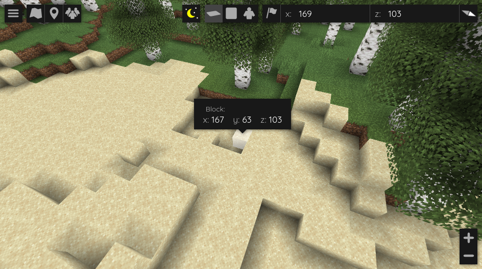
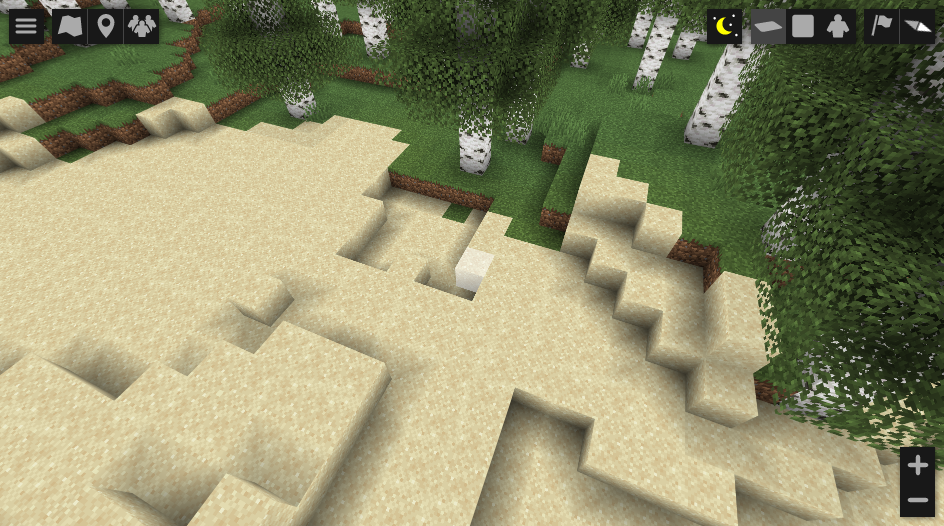

[←Back](..)

# Hidden Position

This style hides the position display in the top right of BlueMap.\
It also hides the position display in the marker popup.

| Original               | Custom               |
|------------------------|----------------------|
|  |  |

> [!WARNING]  
> **This will not prevent people from finding out the coordinates!**\
> It only makes it a bit harder. They can still be found with the browser's developer tools.\
> You should really only use this for aesthetic purposes.

## Installation Instructions

Download or copy the [BlueMapHiddenPosition.css](BlueMapHiddenPosition.css) file to your webapp, and register it.\
([guide](https://bluemap.bluecolored.de/community/Customisation.html#custom-styles-theme-and-look))
