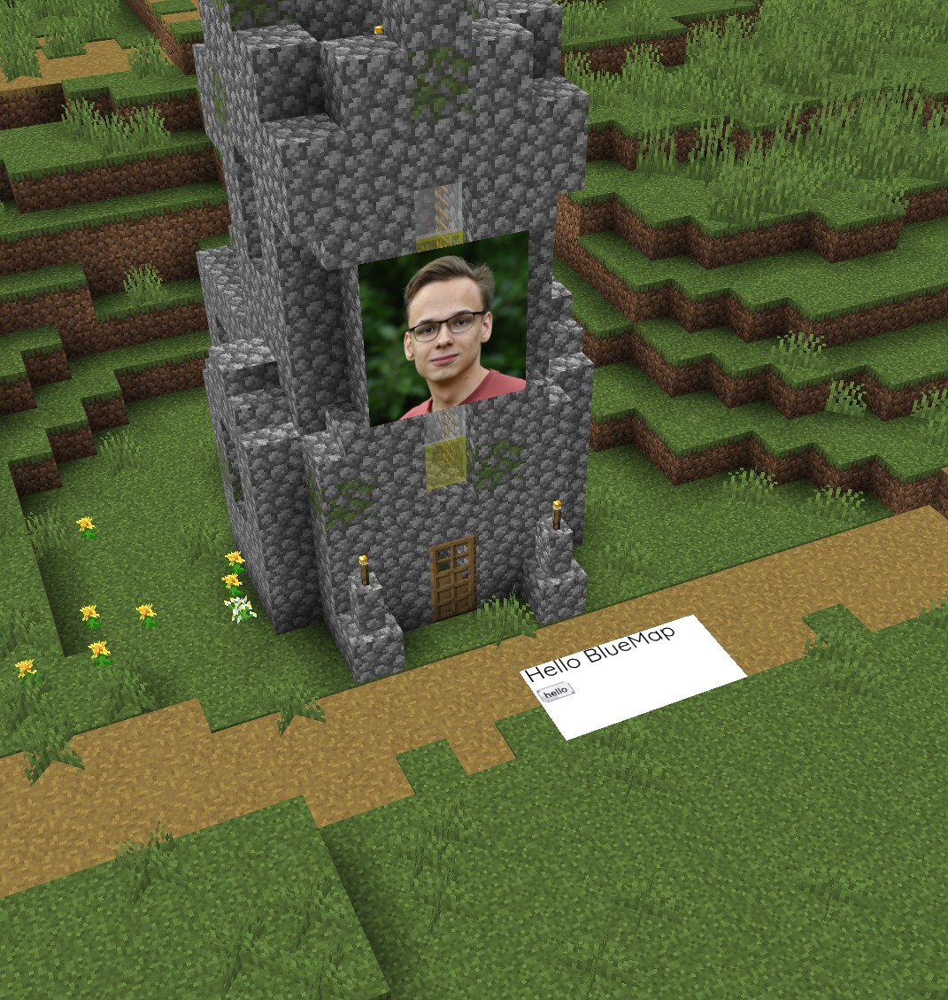

[←Back](..)

# HTML3D

Add HTML markers which are actually positioned and anchored in your worldspace.

## Installation Instructions

Download or copy the [CSS3DRenderer.js](CSS3DRenderer.js) and [html3d.js](html3d.js) files to your webapp, and register only the html3d.js file.
([guide](https://bluemap.bluecolored.de/community/Customisation.html#custom-scripts-behaviour))

## Usage

After adding the script you can take any html marker and add custom classes to them to modify its 3d properties.  
Not even sure if the rotation axises are correct. Just try out what works.  
Anchor is by default the middle of the html element.  
Use underscores for decimal seperator. Negative values are allowed.

| Classname | Description |
| --- | --- |
| `html3d` | Enable 3D rendering for this marker (required). |
| `html3d-density-64` | CSS pixels per block, controls world-space scale (default: 64). |
| `html3d-width-15` | Width in blocks, sets explicit CSS pixel width on the element. |
| `html3d-height-7_5` | Height in blocks, sets explicit CSS pixel height on the element. |
| `html3d-rx-0` | X rotation in degrees (default: 0). |
| `html3d-ry-0` | Y rotation in degrees (default: 0). |
| `html3d-rz-0` | Z rotation in degrees (default: 0). |
| `html3d-doublesided` | Show the marker from both sides (default: hidden when viewed from behind). |

