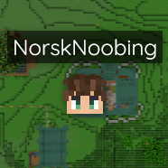
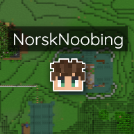
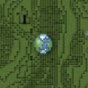
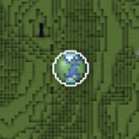

[←Back](..)

# Marker Borders
This is a simple style that adds a small white border to all markers, including playerheads.\
By default, BlueMap just has a dropshadow behind each marker icon.

| Original                      | Marker Borders                      |
| :---------------------------: | :---------------------------------: |
|  |  |
|  |  |

Thanks to a community member [@NorskNoobing](https://github.com/NorskNoobing) for providing this cool feature!

## Installation Instructions
Download or copy the [BlueMapMarkerBorders.css](BlueMapMarkerBorders.css) file to your webapp, and register it.\
([guide](https://bluemap.bluecolored.de/community/Customisation.html#custom-styles-theme-and-look))
