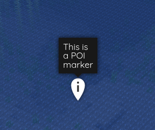
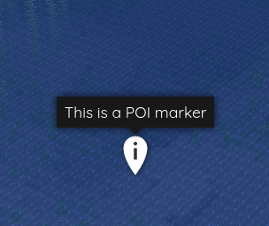

[←Back](..)

# Marker Label Full Width

This style makes marker labels full width, instead of the default width,
which often leads to unwanted line breaks.

| Original               | Custom               |
|------------------------|----------------------|
|  |  |

## Installation Instructions

Download or copy the [BlueMapMarkerLabelFullWidth.css](BlueMapMarkerLabelFullWidth.css) file to your webapp, and register it.
([guide](https://bluemap.bluecolored.de/community/Customisation.html#custom-styles-theme-and-look))

## Customization

With this style, the marker labels will be the full width they may need, which could lead to very long lines.\
You can set a maximum width of the marker labels by editing the `max-width` property in the CSS file:
```css
max-width: 200px !important;
max-width: 50rem !important;
```
(Make sure to keep the `!important` flag.)
