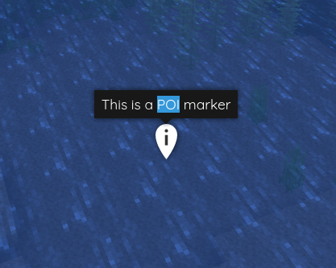

[←Back](..)

# Marker Label Select

This style makes marker labels selectable, so you can copy the text or click on links or buttons.\
By default, it disappears when you try to click it.

## Installation Instructions

Download or copy the [BlueMapMarkerLabelSelect.css](BlueMapMarkerLabelSelect.css) file to your webapp, and register it.
([guide](https://bluemap.bluecolored.de/community/Customisation.html#custom-styles-theme-and-look))
