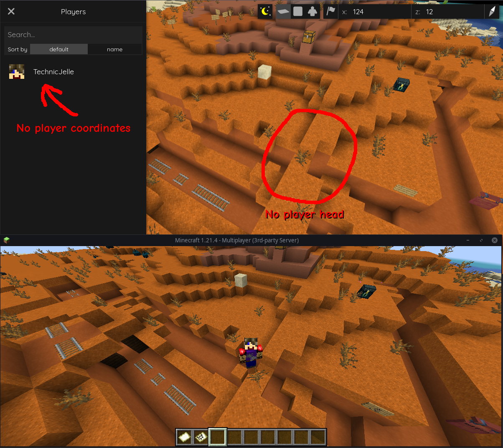

[←Back](..)

# Player Privacy

Hides players in the world but does keep them visible in the player list.

> [!CAUTION]
> Player positions can still be found via the browser's developer tools!
> This is impossible to fix with a Web Addon, so do not rely on this for very important privacy.

## Installation Instructions

This script requires two files: a JavaScript file and a CSS file.

Download or copy both the [BlueMapPlayerPrivacy.js](BlueMapPlayerPrivacy.js) script file
and the [BlueMapPlayerPrivacy.css](BlueMapPlayerPrivacy.css) style file to your webapp, and register them.

Here is a [guide for registering the js file](https://bluemap.bluecolored.de/community/Customisation.html#custom-scripts-behaviour)
and a [guide for registering the css file](https://bluemap.bluecolored.de/community/Customisation.html#custom-styles-theme-and-look).
