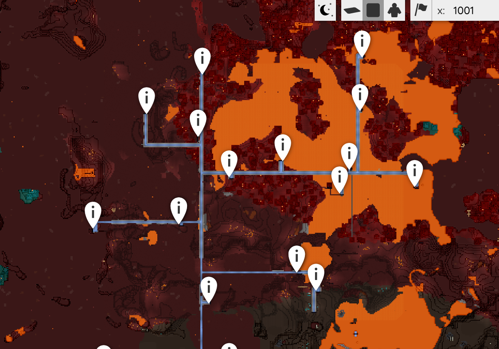
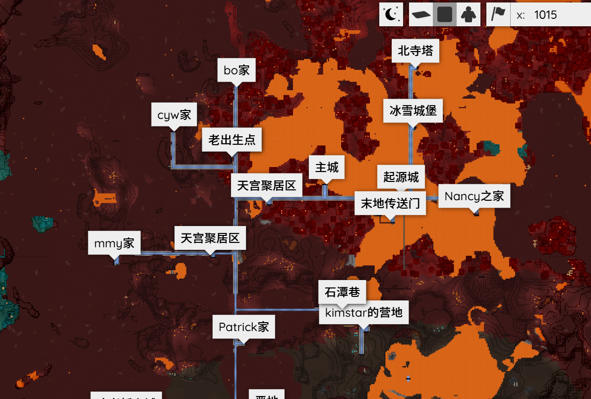

[←Back](..)

# PoiMarkers-AlwaysShowLabels

Make the label of POI markers always to be visible on Bluemap.

Currently, labels will only show up when you click a certain POI marker, so those maps that contains a large number of POI markers will seem to be greatly confusing and unintuitive. This script solved such problem.

Just as the following comparison:

| Original               | Always Visible               |
| ---------------------- | ---------------------------- |
|  |  |

## Installation Instructions

Download or copy the [PoiMarkersAlwaysShowLabels.js](PoiMarkersAlwaysShowLabels.js) file to your webapp, and register it.\
([guide](https://bluemap.bluecolored.de/community/Customisation.html#custom-styles-theme-and-look))

> [!WARNING]  
> This script is a temporary solution, which is highly depending on the code structure of bluemap, and the function may be broken in the future when related code in Bluemap are changed.