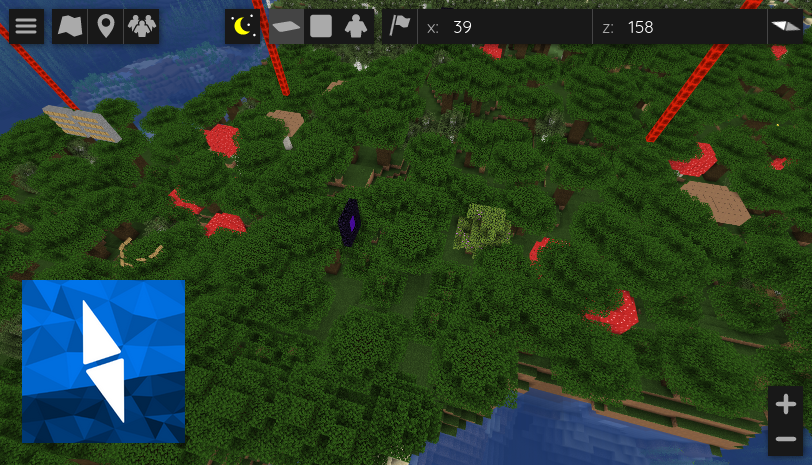

[←Back](..)

# Watermark
If you want to add a clickable watermark to your map, you've come to the right place!

Here's an example watermark image of the BlueMap logo:

## Installation Instructions
This script requires two files: a JavaScript file and a CSS file.

Download or copy both the [BlueMapWatermark.js](BlueMapWatermark.js) script file
and the [BlueMapWatermark.css](BlueMapWatermark.css) style file to your webapp, and register them.

Here is a [guide for registering the js file](https://bluemap.bluecolored.de/community/Customisation.html#custom-scripts-behaviour)
and a [guide for registering the css file](https://bluemap.bluecolored.de/community/Customisation.html#custom-styles-theme-and-look).

## Options
In the JavaScript file, you can change the `anchor.href` link to change the link the watermark goes to when clicked.
And you can change the `watermarkImage.src` link to change the actual image of the watermark.  
This can be a relative link, to a local file that you copied into BlueMap's webroot somewhere,
or it can be a link to an image somewhere else on the internet.  
I personally recommend always linking to local images, though.

In the CSS file, you can change the placement and the size of the watermark.  
If you don’t know how to write CSS yet, here is a good guide: [developer.mozilla.org/en-US/docs/Learn/CSS](https://developer.mozilla.org/en-US/docs/Learn/CSS)
